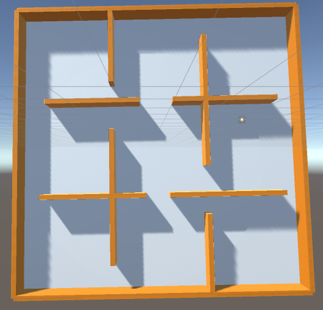
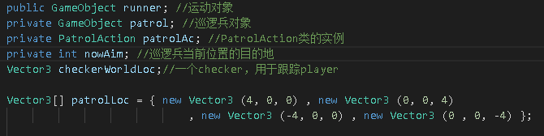
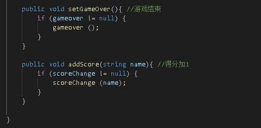

# 作业七：模型与动画
## 智能巡逻兵  
### 演示视频链接：http://www.iqiyi.com/w_19sbeqytgx.html
提交要求：
- 游戏设计要求： 
   - 创建一个地图和若干巡逻兵(使用动画)；
   - 每个巡逻兵走一个3~5个边的凸多边型，位置数据是相对地址。即每次确定下一个目标位置，用自己当前位置为原点计算；
   - 巡逻兵碰撞到障碍物，则会自动选下一个点为目标；
   - 巡逻兵在设定范围内感知到玩家，会自动追击玩家；
   - 失去玩家目标后，继续巡逻；
   - 计分：玩家每次甩掉一个巡逻兵计一分，与巡逻兵碰撞游戏结束；
- 程序设计要求： 
   - 必须使用订阅与发布模式传消息 
   - 工厂模式生产巡逻兵  

## 设计过程    
## 预制的制作(参考师兄)  
直接从已有的库中下载士兵预制  
- 巡逻兵（Patrol）  
  
  
- 玩家（player）  
  
  
- 地图（map）  
  
  
- 计分器（score）  
  
  
  
    

## PatrolInfo.cs  
这一部分为巡逻兵（Patrol）的信息，包含了巡逻兵预制的实例化，巡逻兵的位置设置，调用PatrolAction.cs对巡逻兵的动作信息进行设置等。   
- 基本数据结构  
  
  
- 预制的实例化  
  
  
- 实例的拷贝  
因为是用工厂模式产生，所以要考虑父子实例的位置的改变，有setParent函数实现  
  
  
- 目的地设置  
因为每一个巡逻兵走的是3~5边的凸边形，每次“撞墙”后都要设置下一个目标位置，由函数setNewAim实现（具体的位置变化在PatrolAction中实现需要调用PatrolAction中的setAim函数）  
  
  
- 巡逻兵的移动  
  
  
- 巡逻兵信息的重置  
用于重新开始游戏  
  
  
## PatrolAction.cs  
这一部分主要是设置巡逻兵位置的变化和速度（注意当附近有player时patrol的运动状态会变化，附近指的是patrol的四邻域，这在PatrolInfo中有实现）  
  
  
  
## PatrolFactory  
工厂模式生产巡逻兵，具体的生产方式已经在PatrolInfo中实现，直接调用PatrolInfo类的构造函数就行了  
  
  
## PlayerMove.cs  
此部分实现玩家的移动，包括移动的方向、移动的速度以及与其他物体碰撞的时间设置  
- 基本数据结构  
  
  
- 玩家移动的控制函数  
  
  
- 玩家移动的操作方法  
规定8个移动方向（上为“W”，下为“S”,左为“A”，右为“D”），其中，规定45°方向的移动必须是在上或下操作进行时执行，移动的方向都是相对全图的方向  
  
  
- 碰撞事件设置  
包括两个分事件：1、碰到patrol； 2、碰到score。事件的设置如下（需要调用EventManager中的两个函数）  
  
  
- EventManager函数  
  
  
## PlayerController.cs
此部分为玩家的控制器，包含玩家预制的实例化、玩家的初始位置设置以及玩家信息的重置函数  
  
  
## CheckerController.cs  
此部分实现socre预制的实例化以及地图相对玩家的出口和入口设置（注意判断到达的对象是否为player）  
  
  
## ScoreController.cs  
此部分为计分器，比较容易，代码如下  
  
  
## firstSceneController.cs  
此部分为场景控制器，包括了场景的初始化，游戏状态的初始化，map和checker预制的实例化，游戏重置函数以及状态、分数的获得  
- 游戏状态的初始化（简单起见，直接将初始状态设置为“running”）以及checker位置的初始化（用8个Vector3初始化）  
  
  
- 场景的初始化（调用各类函数，包括UI、行为、计分器、预制加载等）  
  
  
- 游戏重置等其他函数  
  
  
## UserGui.cs  
此部分为游戏的UI设置，因为前面偷懒将初始状态设置为了running，并且一些对象的位置设置在其他部分都已经实现了，所以就只需对游戏结束后的信息显示以及重启游戏的按键进行设置了  
  
最终的UI如下：  
  
  

### 至于其他的诸如导演类、动作管理器类及其基类（有动作分离）、单例等的实现与前一次差不多，就是一些函数的名称定义不同而已，在此就不一一解释了。