# 作业三：空间与运动
## 1、简答并用程序验证【建议做】
- 游戏对象运动的本质是什么？
     > 游戏对象的运动，实质上是游戏对象相对于原来位置或者相对于其他游戏对象位置的改变，对应transform组件中的position、rotation和scale等属性的变化。 
- 请用三种方法以上方法，实现物体的抛物线运动。（如，修改Transform属性，使用向量Vector3的方法…）  
    - 一、直接改变transform组件的position属性  
      
        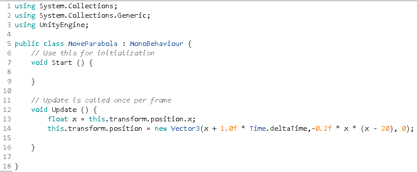  
      
    - 二、利用transform的translate方法，分别实现物体在x轴方向上和y轴方向上的移动，通过两个方向运动的合成达到抛物线运动的效果。 

        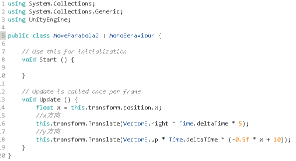  
           
    - 三、利用物体的rigidbody组件，通过rigidbody组件的MovePosition方法实现物体的抛物线运动  
      
        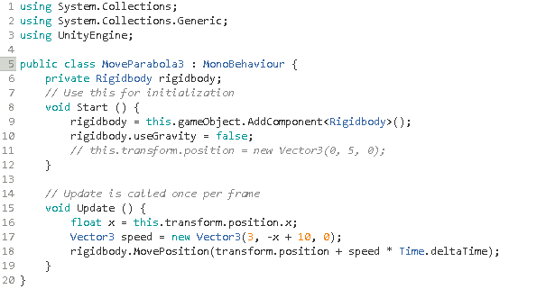  
          

- 写一个程序，实现一个完整的太阳系， 其他星球围绕太阳的转速必须不一样，且不在一个法平面上。
## 2、编程实践
**需求：**
- play the game ( http://www.flash-game.net/game/2535/priests-and-devils.html )
- 列出游戏中提及的事物（Objects）
    > 环境（environment：包括rightshore（右岸）、leftshore（左岸）、river（河））、3个恶魔（devil）、3个牧师（priest）、船（boat）

- 用表格列出玩家动作表（规则表），注意，动作越少越好
    |  事物   | 动作  |
    |  ----  | ----  |
    | 恶魔  | 上船或上岸 |
    | 牧师  | 上船或上岸 |
    |  船   |   过河  |
- 请将游戏中对象做成预制  
  
    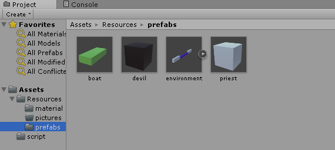  

- 使用 C# 集合类型 有效组织对象
- 整个游戏仅 主摄像机 和 一个 Empty 对象， 其他对象必须代码动态生成！！！ 。 整个游戏不许出现 Find 游戏对象， SendMessage 这类突破程序结构的 通讯耦合 语句。 违背本条准则，不给分
- 请使用课件架构图编程，不接受非 MVC 结构程序
- 注意细节，例如：船未靠岸，牧师与魔鬼上下船运动中，均不能接受用户事件！
### 脚本编写过程  
- 首先编写Director.cs作为脚本主体  

    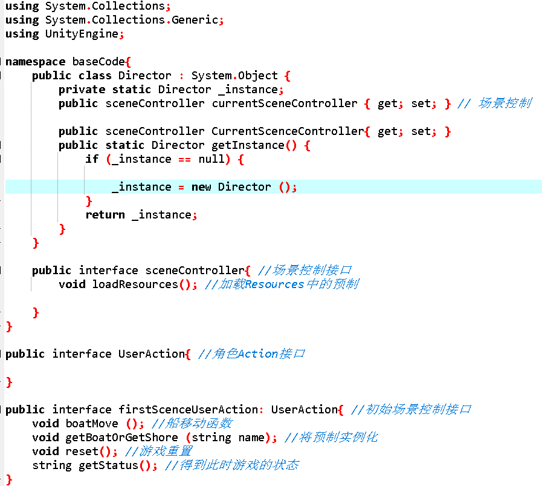  
      
- 场景控制脚本firstSceneController.cs
    - 先设置表示事物的变量，并通过调用loadResources()将预制实例化 
     
        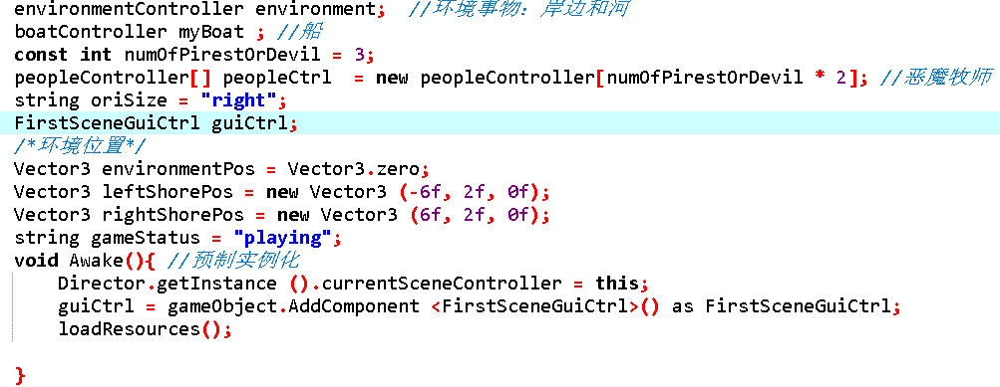  
       
    - 然后是update()函数对游戏结果进行设置  
      
        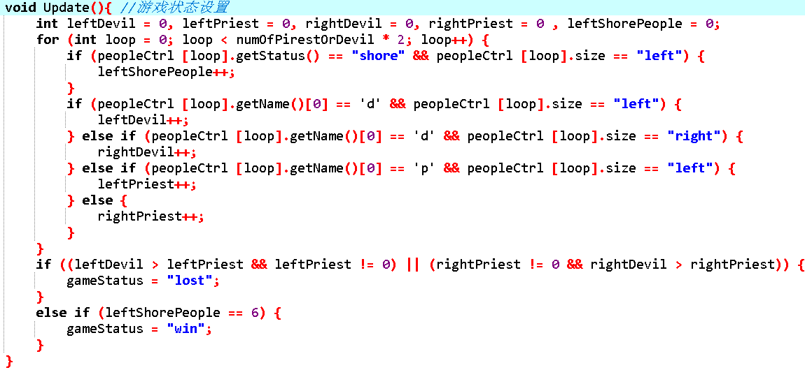  
          
    - getStatus()函数得到游戏状态，reset()函数将游戏重置
      
        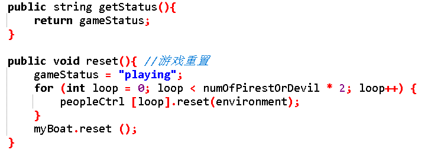  
          
    - loadResources()加载预制，生成3个恶魔和3个牧师
      
        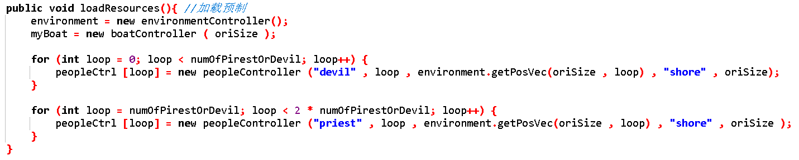  
    
    - boatMove()函数调用船控制(boatController)类中的move()函数，当getRunningState()函数(船是否被点击能够移动)的返回为"Running"时，控制船体移动  
      
        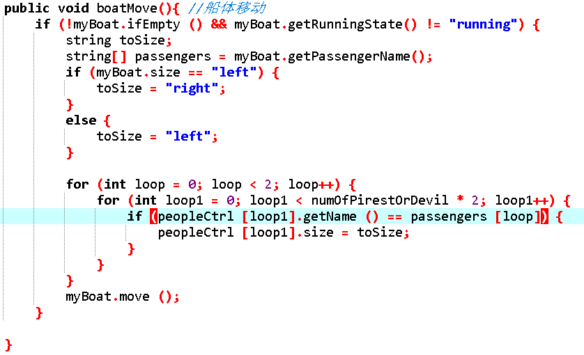  
          
    - getBoatOrGetShore()函数设置恶魔或牧师上船或上岸的条件  
      
        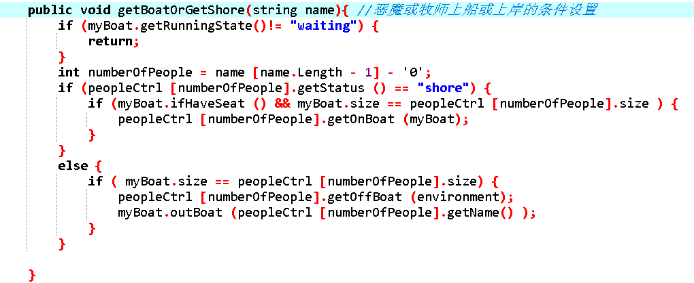  
    - **以上是firstSceneController类（初始场景设置类），接下来是boatController类（船功能设置类）**  
  
   - 构造函数加载Resources中的boat预制并将其实例化  
     
        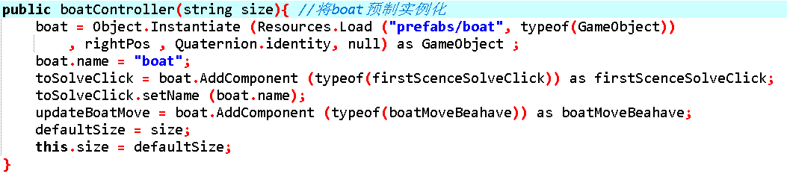  
          
    - ifEmpty()函数判断boat是否为空，ifHaveSeat()函数判断boat是否有空位（用于判断恶魔或牧师是否能上船）  
      
        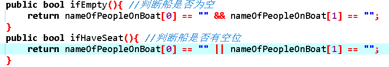  
          
    - move()函数通过调用boatMoveBeahave类中的setAim()设置船的目的地以及改变船的状态为Running  
      
        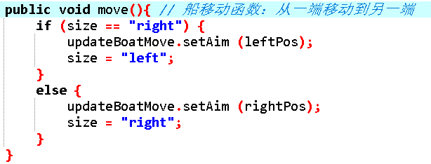  
        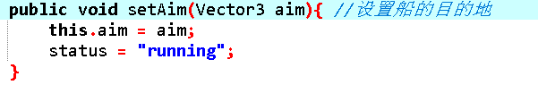  
      
    - getRunningState()函数调用boatMoveBeahave类中的getState()函数获取当前船的状态；getPassengerName()函数获取船上角色信息；getBoat()函数返回一个Boat  
      
        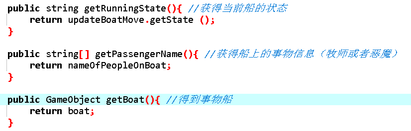  
        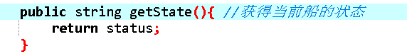  
          
    - outBoat()函数，当船上某个位置的角色离开船时，调用此函数将该位置的角色name设置为空  
      
        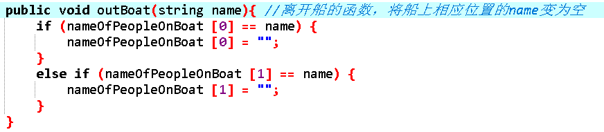  
          
    - getBoatPos()函数和船信息重置函数reset()  
      
        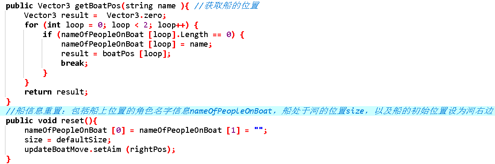  
          
    - boatMoveBeahave类：具体实现船移动时transform组件position变化以及移动速度设置和船的状态设置  
  
        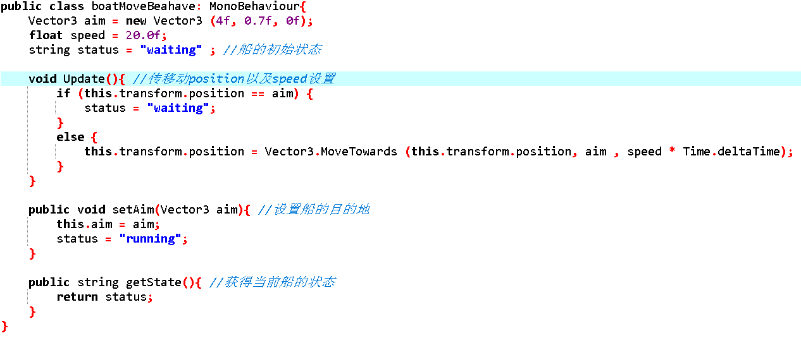  
     
    - environmentController类：对环境（河和岸边）进行设置，包括将预制实例化，以及位置大小设置  
  
        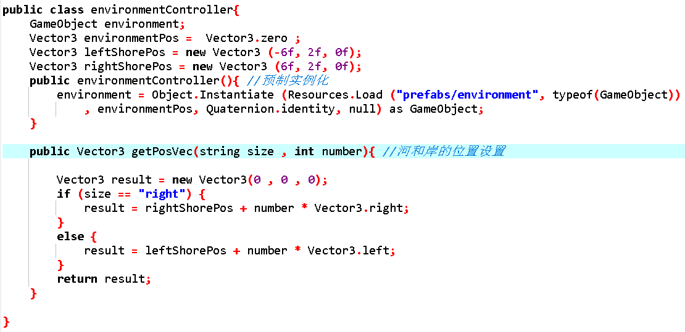  
      
    - peopleController类：对角色（恶魔和牧师）进行设置，包括构造函数将预制实例化；getName()函数获取角色名字，getStatus()获取角色状态（“boat”或者“shore”）表示角色在岸上还是在船上；getOnBoat()和getOffBoat()函数通过改变boat的status为“boat”和“shore”分别表示角色上船和上岸；reset()函数重置角色：将角色的状态改为“shore”并将位置变为默认的岸上位置  
  
        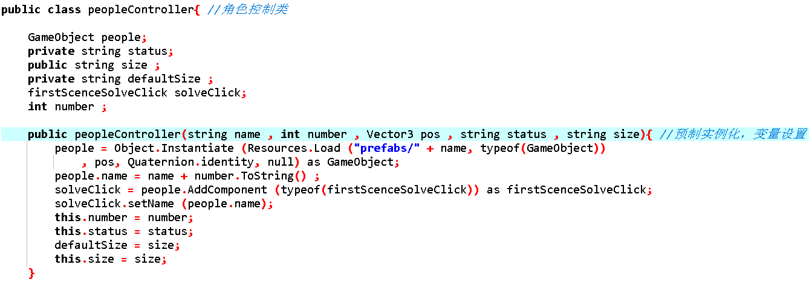  
        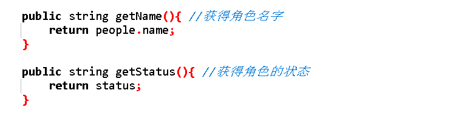  
        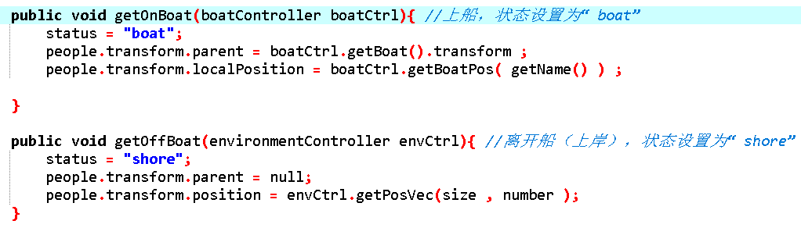  
        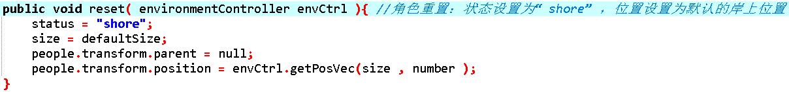  
          
- GUI控制类脚本GuiCtrl.cs  
    - 这一部分相对容易，就是确定每个功能按键的位置以及实现每个按键的功能，就不用细讲了  
      
        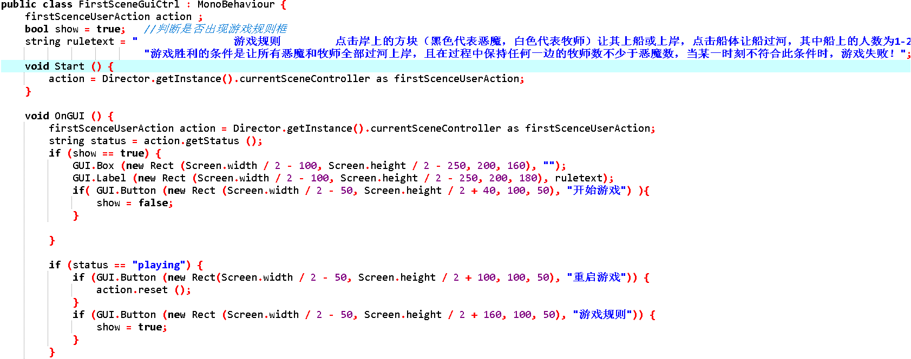  
        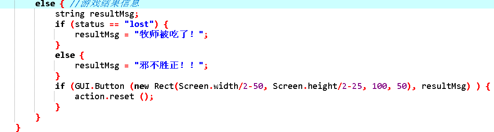  
          
- 最后实现事物点击事件的处理脚本solveClick.cs，处理点击恶魔、牧师或者船体后的发生事件：状态、位置的改变。  
  
    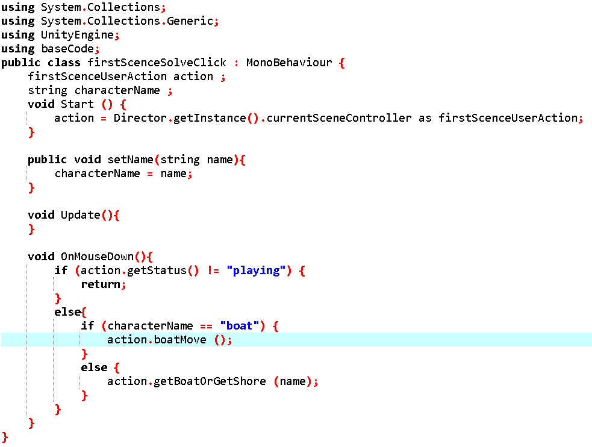  
  
- 初始UI图如下  
  
    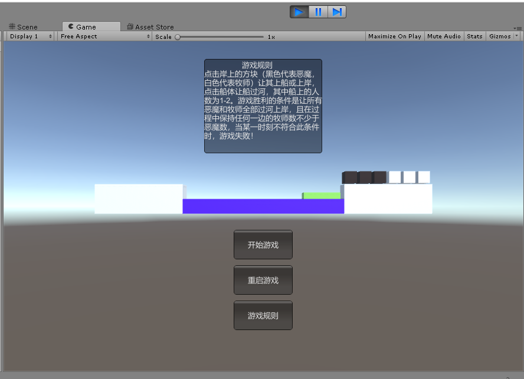  
  
### 演示视频地址：
## 3、思考题【选做】
- 使用向量与变换，实现并扩展 Tranform 提供的方法，如 Rotate、RotateAround 等