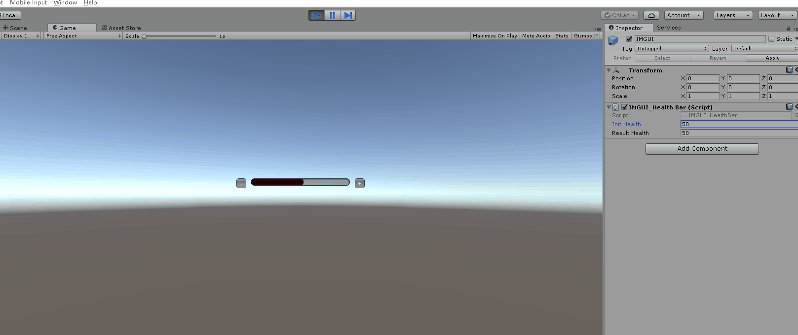
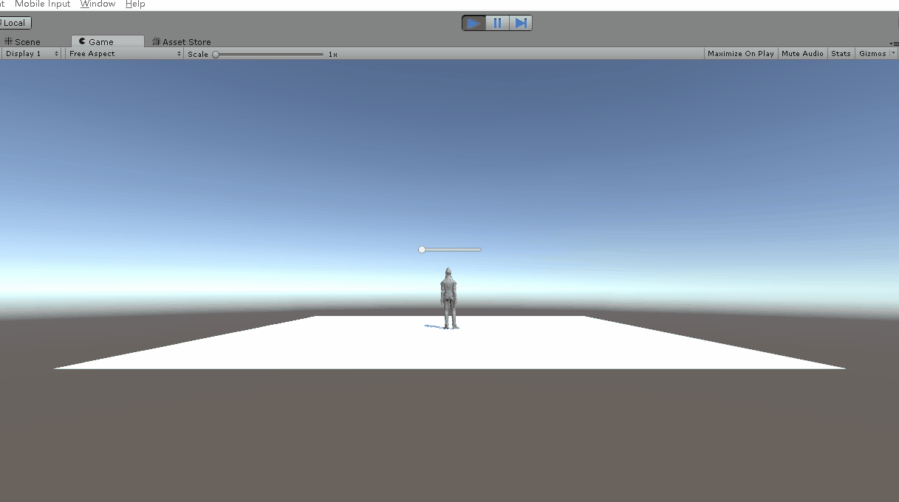

# 血条预制制作
## 要求  
- 分别使用 IMGUI 和 UGUI 实现
- 使用 UGUI，血条是游戏对象的一个子元素，任何时候需要面对主摄像机
- 分析两种实现的优缺点
- 给出预制的使用方法  

## IMGUI实现  
脚本代码：
```C#
using UnityEngine;

public class IMGUI_HealthBar : MonoBehaviour {
	public float initHealth = 50; //初始血量
	public float resultHealth = 50; //增减后血量

	private Rect HealthBar; //血条
	private Rect AddBlood; //加血
	private Rect SubBlood; //减血

	void Start () {

	}

	void OnGUI () {
		HealthBar = new Rect((Screen.width - 200) / 2, (Screen.height - 60) / 2, 200, 40); //血条框
		AddBlood = new Rect((Screen.width + 220)/ 2, (Screen.height - 60) / 2, 20, 20); //加血按钮
		SubBlood = new Rect((Screen.width - 260)/ 2, (Screen.height - 60) / 2, 20, 20); //减血按钮

		if (GUI.Button(AddBlood, "+"))
			resultHealth = initHealth + 10 > 100 ? 100 : initHealth + 10;
		if (GUI.Button(SubBlood, "-"))
			resultHealth = initHealth - 10 < 0 ? 0 : initHealth - 10;
		GUI.color = Color.red;  //颜色设置
		initHealth = Mathf.Lerp(initHealth, resultHealth, 0.1f); //进度条显示
		GUI.HorizontalScrollbar(HealthBar, 0, initHealth, 0, 100); //水平滚动条设置
	}
}

```
- Mathf.Lerp(float start, float end, float c)函数：进度显示，start为起始位置，end为目标位置，c是百分比  
- GUI.HorizontalScrollbar(Rect bar, float left, float length, float right, float width)函数：设置水平滚动条，bar为一个进度框，left为进度条与进度框左边的距离，length为进度条的长度，right为进度条向右延申长度，width为进度框的长度  
- 运行效果如下  

       

## UGUI实现 
参考老师给的文档：
- 菜单 Assets -> Import Package -> Characters 导入资源  
  
      
  
- 在层次视图，Context 菜单 -> 3D Object -> Plane 添加 Plane 对象
    
      

- 资源视图展开 Standard Assets :: Charactors :: ThirdPersonCharater :: Prefab  

      
- 将 ThirdPersonController 预制拖放放入场景，改名为 Ethan  

      
- 检查以下属性 
   - Plane 的 Transform 的 Position = (0,0,0)  

          
   - Ethan 的 Transform 的 Position = (0,0,0)  
    
          
   - Main Camera 的 Transform 的 Position = (0,1,-10)  

          
- 运行效果如下  

      
- 选择 Ethan 用上下文菜单 -> UI -> Canvas, 添加画布子对象  

      
- 选择 Ethan 的 Canvas，用上下文菜单 -> UI -> Slider 添加滑条作为血条子对象  

    
- 运行效果如下  
  
      

- 选择 Ethan 的 Canvas，在 Inspector 视图  
   - 设置 Canvas 组件 Render Mode 为 World Space  
   - 设置 Rect Transform 组件 (PosX，PosY，Width， Height) 为 (0,2,160,20)   
   - 设置 Rect Transform 组件 Scale （x,y） 为 (0.01,0.01)  

          
  
- 运行效果如下，可以看到血条出现在任务的头顶  

       
   
- 修改血条的属性  
    - 展开 Slider 
        - 选择 Handle Slider Area，禁用并变灰（disable）该元素（取消Inspector面板的"√"）  

            
        - 选择 Background，禁用并变灰（disable）该元素  

              
        - 选择 Fill Area 的 Fill，修改 Image 组件的 Color 为 红色  

              
    - 选择 Slider 的 Slider 组件 
        - 设置 MaxValue 为 100
        - 设置 Value 为 100  

              
    - 修改后的结果  

          
- 给Canvas添加LookAtCamera.cs脚本使血条不随人物旋转  
    ```C#
    /* LookAtCamera.cs */
    using UnityEngine;

    public class LookAtCamera : MonoBehaviour {
        void Update () {
            this.transform.LookAt (Camera.main.transform.position);
        }
    }
    ```  
- 最终运行效果如下：可以看到血条已经不会随人物旋转了  

      

## IMGUI和GUI优缺点比较  
### IMGUI
`IMGUI（Immediate Mode GUI）`是及时模式图形界面，它的存在符合游戏编程的传统，即使在今天它依然没有被官方宣判为遗留（将要淘汰的）系统（Legacy Systems）。按 Unity 官方说法，IMGUI 主要用于以下场景：
- 在游戏中创建调试显示工具
- 为脚本组件创建自定义的 Inspector 面板。
- 创建新的编辑器窗口和工具来扩展 Unity 环境。  

优点：  
- 避免了`UI元素`保持在屏幕最前端，有很好的`执行效率`  
- 新手 UI `入门容易`，帮助新手理解引擎的游戏循环
- 对于高级程序员，创建`在线调试环境`
- 对于工具开发者，定义 Unity 新的`编程工具`

缺点：
- 是`代码驱动`的UI系统，不支持图形化界面设计，只能在OnGUI 阶段用 GUI 系列的类绘制各种 UI 元素  
- UI 元素不能与游戏场景融为一体交互
- 不支持复杂的布局
### UGUI
`Unity GUI / UGUI` 是`面向对象`的 UI 系统。所有 UI 元素都是游戏对象，具有友好的图形化设计界面，可在场景渲染阶段渲染这些 UI 元素。  
优点：  
- 支持跨设备执行，自动适应不同分辨率
- 能实现UI 元素与游戏场景融为一体的交互
- 支持复杂的布局
- 多摄像机支持  
- 面向对象编程  
- 所见即所得（WYSIWYG）设计工具

## 预制使用方法
将Assets/Resources/Prefabs中的预制拖到层次视图，然后运行即可。
