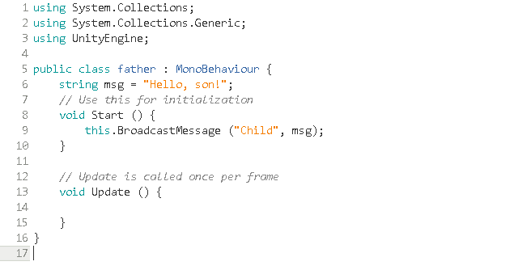

# 作业二：离散仿真引擎基础
## 问题1：简答题【建议做】
- 解释游戏对象（GameObjects）和资源（Assets）的区别与联系。
  >  答：游戏对象是Unity场景里面所有实体的基类，是资源整合的具体表现，一般有物体、摄像机、灯光等。资源是我们自定义或者下载的素材，可以被多个对象使用，通常包括脚本、场景、贴图等，有些资源还可以作为模板并实例化为游戏对象。

- 下载几个游戏案例，分别总结资源、对象组织的结构（指资源的目录组织结构与游戏对象树的层次结构）  
   > 答：**资源的目录结构**：由下图可以看到，每个Unity Project拥有一个Assets（资源）文件夹，可以存放整个项目的所有资源，包括对象、场景、脚本、贴图等，然后我们可以将相同类型的资源放入同一个文件夹中，比如脚本代码、贴图等。  
     
     
     
   > **游戏对象树的层次结构**：由下图的Hierarchy栏可以看到对象树的层次结构是以对象-子对象的形式表示的，即table和chair的关系，Unity中要让一个对象成为另一个对象的子对象只需将其拖到父对象上即可，或者在一个对象下建立新的对象。  

     
     
- 编写一个代码，使用 debug 语句来验证 MonoBehaviour 基本行为或事件触发的条件   
   - 基本行为包括 Awake() Start() Update() FixedUpdate() LateUpdate()  
   - 常用事件包括 OnGUI() OnDisable() OnEnable()  
  
   代码如下：
   ```  
   using System.Collections;
   using System.Collections.Generic;
   using UnityEngine;  
   public class DebugTest : MonoBehaviour {
      void Awake() {
         Debug.Log ("Awake!");
      }

      void Start() {
         Debug.Log ("Start!");
      }

      void Update() {
         Debug.Log ("Update!");
      }

      void FixeUpdate() {
         Debug.Log ("FixeUpdate!");
      }

      void LateUpdate() {
         Debug.Log ("LateUpdate!");
      }

      void OnGUI() {
         Debug.Log ("OnGUI!");	
      }

      void OnDisable() {
         Debug.Log ("OnDisable");
      }

      void OnEnable() {
         Debug.Log ("OnEnable");
      }
   }  
   ```  
  
   将上述代码附给一个对象然后运行，在控制台会得到如下内容：  
  
     
  
   > 可以看出，基本行为中Awake函数是在对象执行脚本之初被调用，且在整个生命周期内只被调用一次；然后调用OnEnable函数激活对象，且激活之后不再调用；接着在第一次进入游戏时调用Start函数；然后在Start函数调用完之后，调用Update函数（循环调用）；然后在所有的Update循环调用里面，当Update调用完之后会调用LateUpdate函数；最后OnGUI函数会在游戏循环的渲染过程中调用，而FixUpdate函数是在每个游戏循环中由物理引擎调用。  

- 查找脚本手册，了解GameObject，Transform，Component对象  
   - 分别翻译官方对三个对象的描述（Description）  
   > 答：**GameObject**：游戏对象，是Unity场景里面所有实体的基类。  
   > **Transform**：变换，物体的位置、旋转和缩放。场景中的每一个物体都有一个Transform，用于储存并操控物体的位置、旋转和缩放。每一个Transform可以有一个父级，允许你分层次应用位置、旋转和缩放。可以在Hierarchy面板查看层次关系。他们也支持计数器（enumerator），因此你可以使用循环遍历子物体。  
   > **Component**：组件，一切附加到游戏物体的基类。  

   - 描述下图中table对象（实体）的属性、table的Transform的属性、table 的部件  
     
         
     
      - 本题目要求是把可视化图形编程界面与 Unity API对应起来，当你在 Inspector 面板上每一个内容，应该知道对应 API。  
      - 例如：table 的对象是 GameObject，第一个选择框是 activeSelf 属性。  
      > 答：**table对象的属性**：activeSelf、activeInHierarchy、Static、layer、scene、tag以及transform。  
      > **table的transform属性**：直接通过右边的Transform面板可以得出，Position（位置）为(1.09,1.47,1.34)，Rotation（旋转角度）为(0,38.98,0)，Scale（大小）为(1,1,1)。  
      > **table的部件有**：Transform、Mesh Filter、Box Collider以及Mesh Renderer。  
   
   - 用UML图描述三者的关系（请使用UMLet14.1.1stand-alone版本出图）  
     
        
     

- 整理相关学习资料，编写简单代码验证以下技术的实现：  
   - 查找对象  
      > 通过名称查找：public static GameObject Find (string name);  
      > 通过标签查找：public static GameObject FindWithTag (string tag);  
      > 通过类型查找：public static Object FindObjectOfType(Type type);  
      
      验证代码如下：  
        
        
      **将上面脚本与Table绑定**  
        
      验证结果(其中对象中没有name为“chair_”的，Table的标签设置为“Finish”)：  

        


   - 添加子对象  
      > 系统函数：public static GameObject CreatePrimitive(PrimitiveTypetype);  
        
      验证代码如下：  
        
        
      **将代码拖到Table上执行**  
        
      验证结果：可以看到新生成一个对象newTable，类型为Cube。  
        
        
        

   - 遍历对象树  
      > 系统函数：foreach (Transform child in transform)  
        
      验证代码如下：  

        
      **将代码拖到Table上执行**  

      验证结果：在控制台上可以看到Table的四个子对象。  

        


   - 清除所有子对象  
      > 系统函数：foreach (Transform child in transform) { Destroy(child.gameObject); }  
        
      验证代码如下：  

        
      **将代码拖到Table上执行**  

      验证结果：可以看到Table的子对象全部被清除了  

        
        
- 资源预设（Prefabs）与 对象克隆 (clone)  
   - 预设（Prefabs）有什么好处？  
      > 答：1、使对象和资源能够被重复利用；2、能够快速生成相同的游戏对象，节省了开发时间；3、能够通过修改预设修改所有的生成对象，这样就不需要对某些具体的对象进行多处修改了。  
   - 预设与对象克隆 (clone or copy or Instantiate of Unity Object) 关系？  
      > 答：预设和对象克隆都可以快速生成相同的游戏对象，但对象克隆生成的对象不会随着源对象的改变而改变，预设生成的新对象会随着预设的改变而改变。  
   - 制作table预制，写一段代码将table预制资源实例化成游戏对象  
      - 首先制作table的预制：直接将table实体拖到Assets中即可；
        
      - 然后是脚本代码：创建一个空的游戏实体，直接在Start函数中调用系统函数Instantiate即可；
        
      - 最后利用脚本实现对预制table的实例化，先将脚本拖到Main Camera，然后在组件中找到脚本，将table的预制拖到脚本中的选项“T”（脚本中创建的GameObject）上，最后点击执行就会生成一个预制的实例。**注意不要将脚本拖到预制上执行，不然会造成自己调用自己出现无限循环**  
        
  
## 问题2：编程实践，小游戏  
> - 游戏内容：简单计算器
> - 计算器功能：浮点数的四则运算、回退以及清零。  
> - 技术限制：仅允许使用IMGUI构建UI  

   ### 代码实现（[链接](codes/简单计算器/calculator.cs)）
   - 首先是一些基本的数据结构：包括分别存储数字以及运算符的两个List，计算器显示栏的字符串result，以及判断上一步操作的两个bool值。另外还有两个功能函数用以判断字符代表数字或是运算符  
     
        
        
   - 接着是计算器按键的UI以及每个按键的功能设置
      - 数字Button：**需要注意的是，根据常规，当result第一个字符为“0”或者当前result为上一个运算的结果（即上一个操作为“=”）时，点击数字按钮不是在result之后添加字符，而是重置数字。**
        
           
         
           
      - 运算符Button：**注意若两个运算符连用会直接报错，同时在点击运算符之后将isCE和isEq变为false，表示此操作不为CE和=。**  

           
           
      - 功能Button：包括小数点“.”（当第一个字符为“.”时，默认前面有“0”），清零“CE”（让result为“0”而不是为空），回退“←”（只能在result不为空时点击）。  
        
           
           
      - 结果显示区域  

            
           
   - 最后是核心函数（“=”Butoon的功能）  
      - 首先要对字符串result进行处理：包括特殊情况的处理（**第一个字符为“-”时在前面加“0”、最后一个字符只能为数字**）以及遍历result将字符分类并分别存储到num和op的List中。  
         
           
           
      - 接着就是运算实现，**因为没有括号的设置，所以必须遵循先乘除后加减的法则，因此需要对op List进行两次遍历，第一次先计算乘除法，第二次再计算剩下的加减法。经过此过程，num List中最后剩下的数字即为计算结果。注意num的类型为float，而result的类型为string，所以需要通过系统函数ToString()将num转化为string。为了下一次运算，最后还要清空两个列表。**  
         
           
           
   ### 结果展示  
     
     
     
   ### 演示视频链接：http://www.iqiyi.com/w_19s9g0zbwt.html （马赛克画质，望忍耐！）  
      
  
## 问题3：思考题【选做】  
- 微软 XNA 引擎的 Game 对象屏蔽了游戏循环的细节，并使用一组虚方法让继承者完成它们，我们称这种设计为“模板方法模式”。  
   - 为什么是“模板方法”模式而不是“策略模式”呢？  
      > **答：因为“策略模式” 的方法不是虚方法，而是一些特定的方法供以算法间的替换。而“模板方法”是通过将特殊的变化定义为虚函数，在子类中完成实现，这样可以有一个特定顺序流程。**  

- 将游戏对象组成树型结构，每个节点都是游戏对象（或数）。  
   - 尝试解释组合模式（Composite Pattern / 一种设计模式）。  
      > **答：组合模式，将对象组合成树形结构以表示“部分-整体”的层次结构，使得用户对单个对象和组合对象的使用具有一致性。有时候又叫做部分-整体模式，它使我们树型结构的问题中，模糊了简单元素和复杂元素的概念，客户程序可以像处理简单元素一样来处理复杂元素,从而使得客户程序与复杂元素的内部结构解耦。**  

   - 使用 BroadcastMessage() 方法，向子对象发送消息。你能写出 BroadcastMessage() 的伪代码吗?  
      - 父类代码：  
        
         将该脚本拖到父对象table上。  

      - 子类代码：  
        
         将该脚本拖到子对象chair上。  
      - 最后点击执行，在控制台会得到输出“Father: Hello son!”，说明父类将Message传给了子类。   
        
- 一个游戏对象用许多部件描述不同方面的特征。我们设计坦克（Tank）游戏对象不是继承于GameObject对象，而是 GameObject 添加一组行为部件（Component）。  
   - 这是什么设计模式？  
      > **答：装饰器模式（Decorator Pattern）。**  

   - 为什么不用继承设计特殊的游戏对象？  
      > **答：装饰器模式（Decorator Pattern）允许向一个现有的对象添加新的功能，同时又不改变其结构，它能动态地给对象添加新的职责。因为特殊的游戏对象往往对应着特殊的职能，若用继承的方式去修改特殊对象的职能相比于装饰器模式的组合方式灵活性太差。这也符合了OO设计的原则：尽量使用聚合的方式，而少用继承。**
