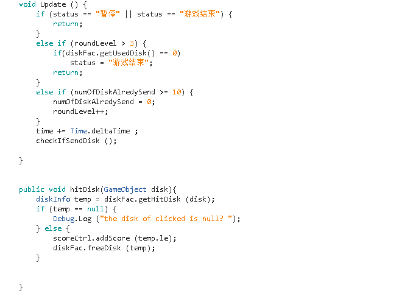

# 作业五：与游戏世界交互
## 1、编写一个简单的鼠标打飞碟（Hit UFO）游戏  
## 演示视频链接：
- 游戏内容要求：   
   - 游戏有 n 个 round，每个 round 都包括10 次 trial；
   - 每个 trial 的飞碟的色彩、大小、发射位置、速度、角度、同时出现的个数都可能不同。它们由该 round 的 ruler 控制；
   - 每个 trial 的飞碟有随机性，总体难度随 round 上升；
   - 鼠标点中得分，得分规则按色彩、大小、速度不同计算，规则可自由设定。
- 游戏的要求： 
   - 使用带缓存的工厂模式管理不同飞碟的生产与回收，该工厂必须是场景单实例的！具体实现见参考资源 Singleton 模板类
   - 近可能使用前面 MVC 结构实现人机交互与游戏模型分离  
### 游戏代码框架
- Director.cs：baseCode，一些基本接口以及类的定义  
- SSAction.cs：动作管理器基类。
- SSActionManager.cs：动作管理类，管理飞碟行为的改变（出现、消失以及飞行）  
- CCActionManager.cs：飞碟行为的重置类  
- diskInfo：用于加载飞碟预制以及产生不同颜色、大小、位置以及速度的飞碟  
- DiskFactory.cs：用于构建飞碟工厂，将被击中的飞碟存入链表，供游戏连续使用  
- diskMove.cs：飞碟的移动函数，规定不同种类飞碟的飞行速度和飞行函数  
- roundController.cs：游戏的导演，总控制器  
- ScoreController：计分器  
- UserGui.cs：游戏的图形界面设计  

### 工厂模式  
> 为了节省内存，提高游戏的运行效率，在游戏运行过程中，被加载的飞碟预制被鼠标点击之后不是被清除内存，而是用一个链表存储起来，在需要新飞碟时，先判断链表中是否存在可以用的飞碟，若没有才需要另外加载预制。  
UML图如下：
  
  
  
代码实现如下：  
  
  
  

其中的diskInfo为一个类：加载disk的预制，并生产颜色、大小、位置以及速度不同的飞碟
  
  
  
### UI
UI设计比较简单，分三个部分，第一栏是状态栏：包括当前游戏状态信息以及得分情况。然后是暂停、继续按钮控制游戏的状态，最后是重置按钮。  
  
  
  
UI效果图：
  
  
  
### 动作管理器  
动作管理器的基类等一些与上次牧师与魔鬼-动作分离版大同小异的地方就不说了。因为这次用到工厂模式，所以飞碟的动作管理是动态的，随着飞出飞碟的颜色、大小的不同而改变。并不单单是对某个特定飞碟而言。同时，与上次不同的是，牧师与魔鬼中的动作管理是靠纯粹的点击事件驱动的，而这次的动作管理虽然也会靠点击事件，但只是击中飞碟飞碟消失与暂停按钮飞碟运动暂停。当游戏处于暂停状态时，就可以直接停止管理器运行而达到暂停的目的。飞碟动作的管理是与飞碟的等待运动队列想匹配的。  
  
  
  
### 总管理器  
因为游戏是回合性的，所以总管理器也可以叫做“回合驱动器”，根据回合去管理角色  

  
  

## 2、编写一个简单的自定义 Component （选做）  
- 用自定义组件定义几种飞碟，做成预制 
   - 参考官方脚本手册 https://docs.unity3d.com/ScriptReference/Editor.html
   - 实现自定义组件，编辑并赋予飞碟一些属性