# 作业八：粒子系统  
## 简单粒子制作  
### 演示视频链接：
### 1、背景添加  
为了让最终的粒子系统更好的呈现，先添加一个背景：
- 先在Hierarchy界面创建一个空的GameObject，命名为“Background”，在其Inspector中“Add Component -> Rendering -> GUI Texture”，并将该对象的Layer同样命名为“Background”  
- 然后将Assets中的背景图片拖到“Texture”栏，调整其位置，使其能够占满整个页面，结果图如下：  
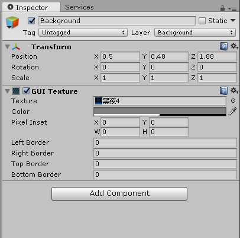  
- 接着在Hierarchy界面添加一个Camera，命名为“Background Camera”，在Inspector界面做以下修改：
   - 将“Clear Flags”选项改为“Solid Color”  
   - “Culling Mask”选项改为“Background”（表示遮蔽图为背景图片）  
   - “Depth”改为-1  
   - 取消下方“Flare Layer”和“Audio Layer”的勾选，只选择“GUI Layer”  
结果图如下：  
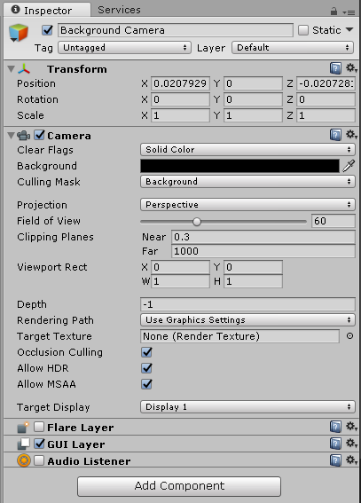  
- 最后修改“Main Camera”，在其Inspector界面做以下修改：
   - 将“Clear Flags”选项改为“Depth Only”  
   - “Culling Mask”选项勾选除“Background”的所有  
结果图如下：  
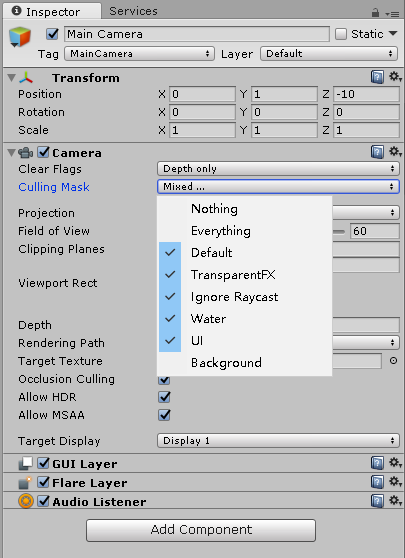  
- 最终的效果图如下：  
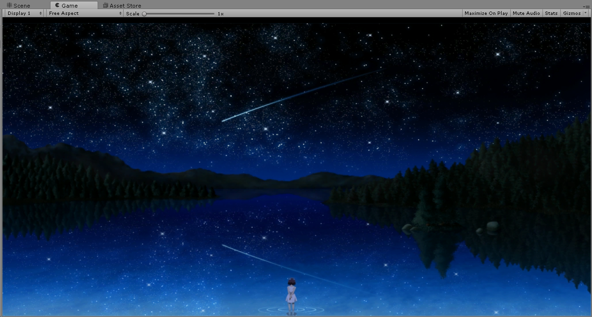  
  
  
### 2、粒子环制作  
- 在Hierarchy界面创建一个Particle System，对其Inspector做以下设置：  
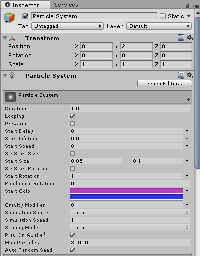  
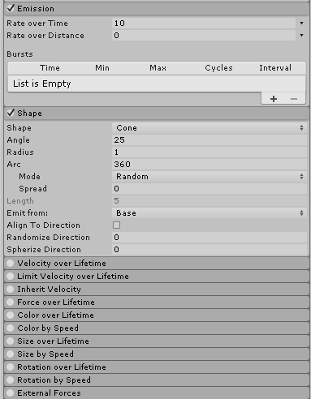  
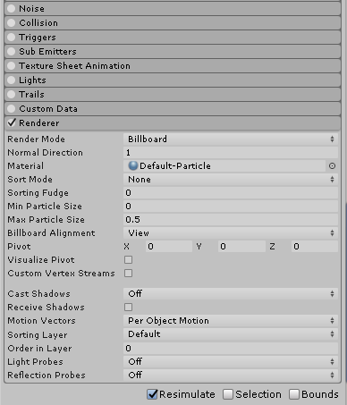  
  
- 然后通过"ParticleMove"脚本来设置粒子的属性和运动情况  
   - 先用一个类ParticleAttr定义粒子的两个属性：旋转的半径和角度  
   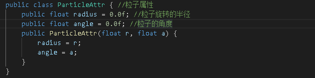  
   - 然后创建一个粒子系统ParticleRing，同时定义该粒子系统的组成：粒子数组、粒子属性数组、粒子数、粒子的旋转最大、最小半径、粒子的层数和粒子旋转的速度  
   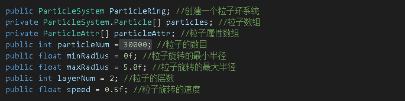  
   - 接着通过Emit函数动态随机产生粒子，并通过GetParticles函数获得产生的粒子，为其设置相应的属性。其中粒子的旋转半径为最大最小半径之间的随机数，角度为0-360°间的随机数  
   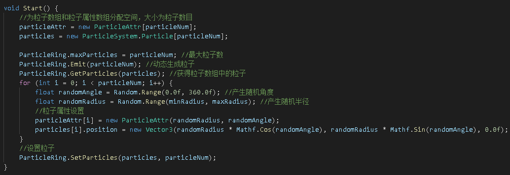  
   - 最后将粒子分层，每一层按不同的方向旋转，最外层为顺时针，往里交替  
   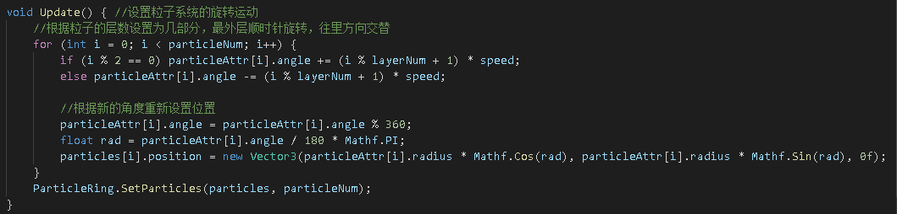  

- 将"ParticleMove"脚本添加到ParticleSystem的组件中  
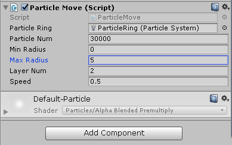  
  
- 最终的静态结果图如下：
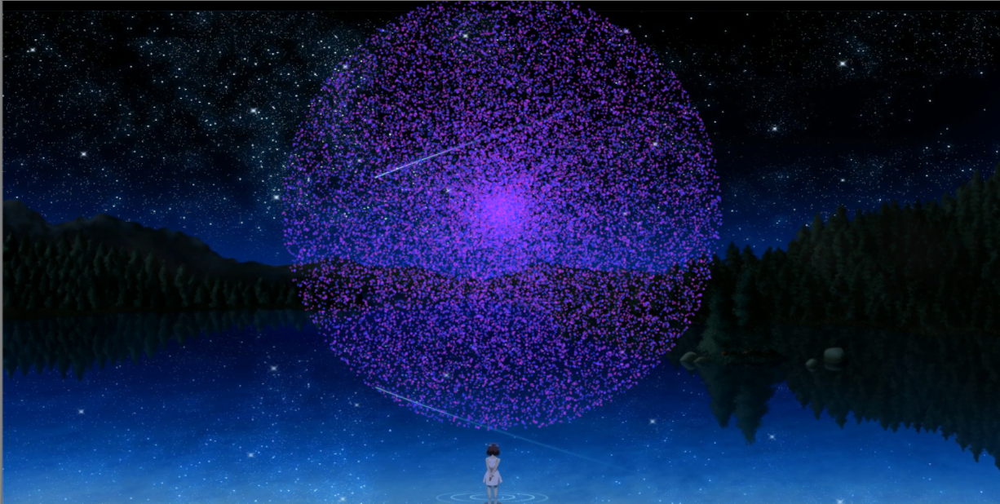  