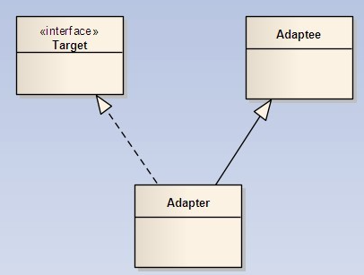
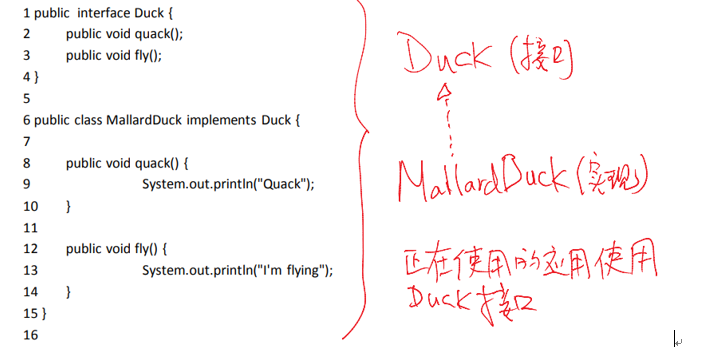
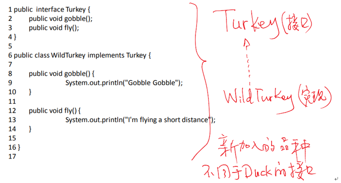
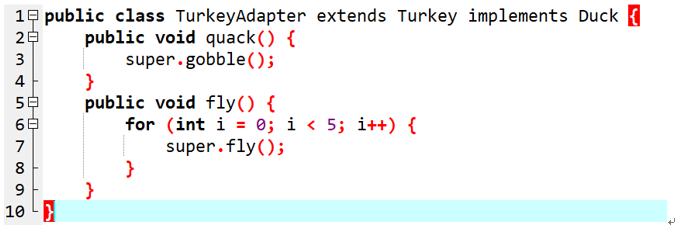
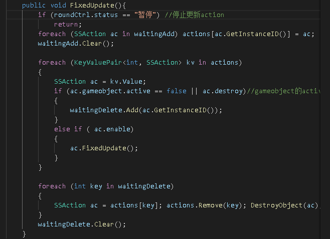
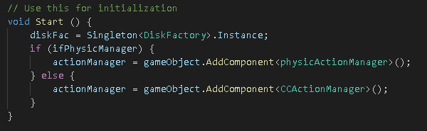
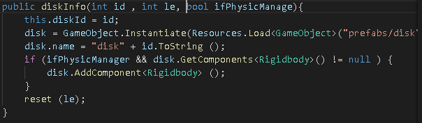
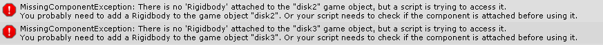
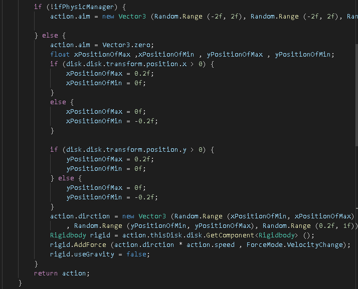

# 作业六：物理系统与碰撞  
1、改进飞碟（Hit UFO）游戏：
## 演示视频链接：
- 游戏内容要求： 
   - 1.按 adapter模式 设计图修改飞碟游戏
   - 2.使它同时支持物理运动与运动学（变换）运动  
## adapter模式
> 将一个类的接口转换成客户希望的另外一个接口。Adapter模式使得原本由于接口不兼容而不能一起工作的那些类可以一起工作。适配器模式主要有两种：对象适配器和类适配器。    
一个适配器主要包含三个部分：Target（客户希望的接口）、Adaptee（已有接口）以及Adapter（适配器类）  

- 下面以“Turkey Among Duck”的例子简单介绍一下类适配器  
  
     
      
- “Target”是“Duck”接口，然后MallardDuck类实现此接口（定义Duck的两个动作quack和fly作为Duck的特征）  
  
     
  
- "Adaptee"是“Turkey”接口，WildTurkey类实现Turkey接口（定义Turkey的两个特征：gobble和fly）  
  
     
     
- 接下来是Turkey类适配器，作用是将Duck类转换成Turkey类，内容是通过直接继承Adaptee（Turkey类）的方式实现Target（Duck类）  
  
     
     
> 由以上例子可以看到，适配器的作用将两个特征不同的对象联系起来，同时其中一个对象可以通过适配器转换成另一个对象。当已有的接口不能满足客户需求时，适配器就显得尤为重要。  
在Hit-UFO的游戏例子中，适配器模式针对的显然是飞碟的移动。  
下面将具体阐述这次适配器模式的Hit-UFO游戏在上次工厂模式的Hit-UFO下的一些改变。  
  

- 定义一个新的类physicActionManager实现一个物理系统作为一个适配器，此类与CCActionManager的作用类似，都是控制飞碟物理运动，因为这次的游戏只涉及到飞碟这一种对象的运动，所以两个类的实现基本相同，当有另外一种对象参与时，该类就与CCAction...有区别  

     
     

- 在场景控制器roundController中修改start函数，与原来不同的是，这次定义了一个物理系统的选项(其中ifPhysicManager是自己定义的bool参数，可以在Unity的组件面板选择)  
  
     
     
     
- 在diskInfo类（飞碟信息）中给飞碟预制的实例添加刚体（Rigidbody），不然会出现以下报错  
  
     
        
  
- 修改diskMove类，调用前面写好的物理系统，为了与前面的版本对比，与原来的Move不同的是，物理系统取消了重力的作用  
  
     
     
- 还有一些其他的细节需要修改，因为新增了一个bool参数ifPhysicManager来选择是否使用物理系统（适配器），在此就不一一列举了。  
  

2、打靶游戏（可选作业）：
- 游戏内容要求： 
   - 1.靶对象为 5 环，按环计分；
   - 2.箭对象，射中后要插在靶上 
      - 增强要求：射中后，箭对象产生颤抖效果，到下一次射击 或 1秒以后
   - 3.游戏仅一轮，无限 trials； 
      - 增强要求：添加一个风向和强度标志，提高难度