# 作业十一：AR/MR 技术
## 图片识别与建模（`Vuforia`）
### `Vuforia`结合`Unity`使用
1、**`注册Vuforia账号`**  

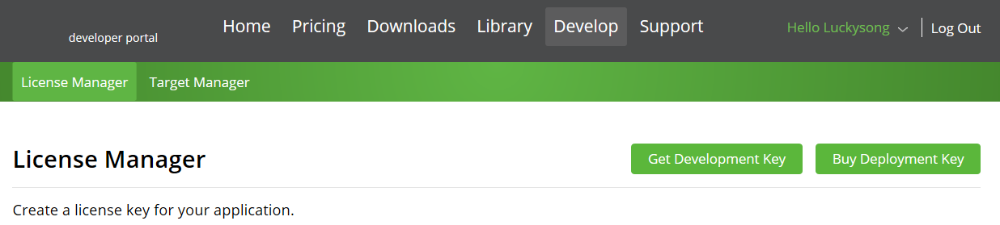  

2、**`创建证书`**  
获取`License Key`：`Vuforia`在`Unity`中需要相应的Key对`SDK进行配置`，否则无法使用  

  
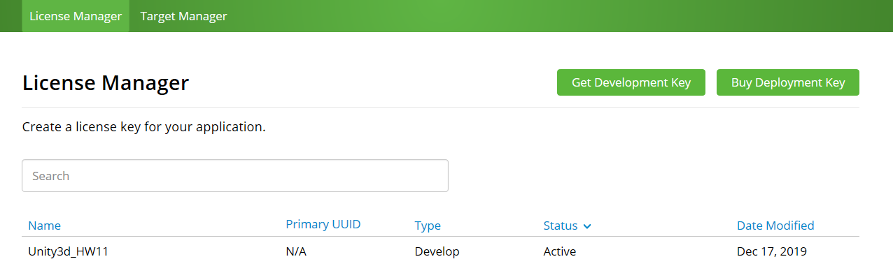  
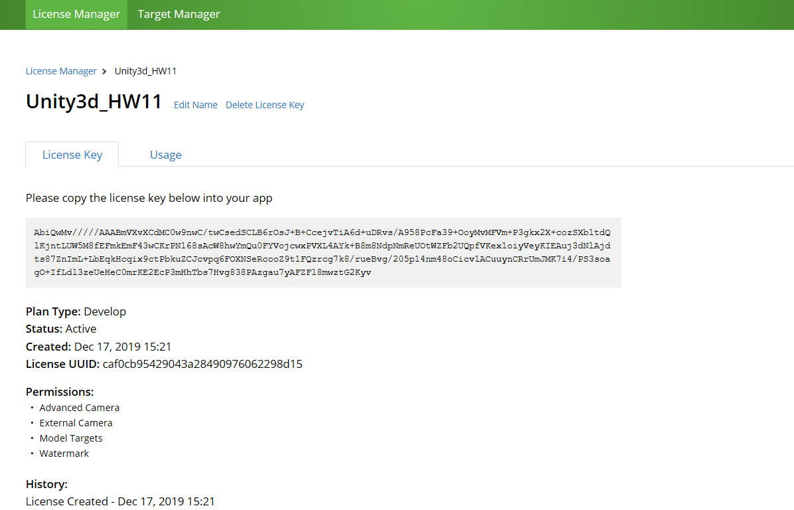  

3、**`创建目标数据库`**
数据库用于对所有`Target`及其`特征数据`进行管理和保存  

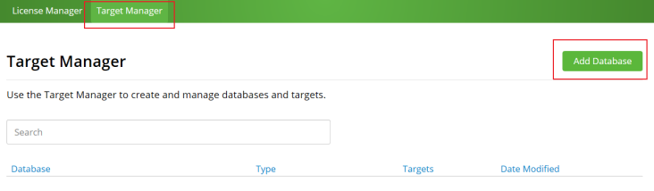  
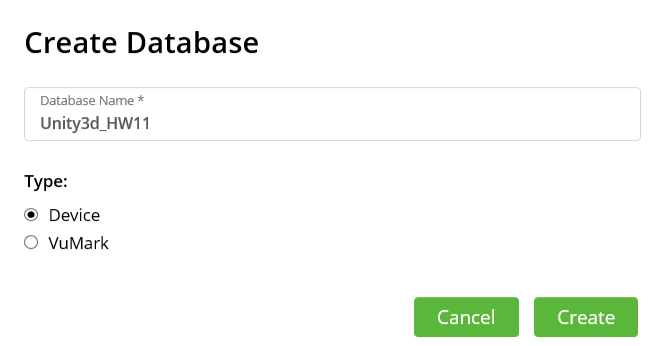  
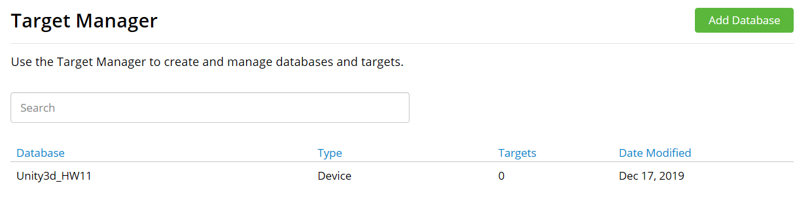  

4、**`识别图像上传`**  
Vuforia要求将特定识别的目标`提前上传`至`数据库`进行`特征提取`。目标有多种类型，此处选择`image`，以对单幅图像进行识别  
- 点击Database的`Targets`栏，再点击`Add Target`  

    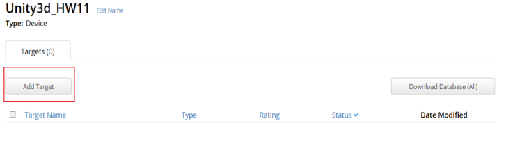  

- 选择`Single Image`，上传识别的图片，设置显示的`宽度`为2，图片命名为`SuperMan`  

    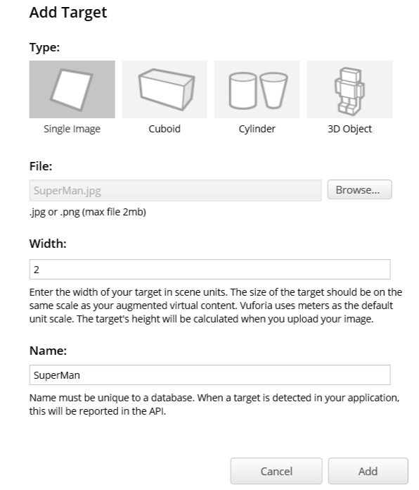  
    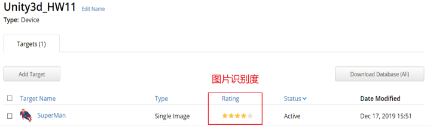  
5、**`创建Unity新项目, 在Vuforia官网中下载`Unity扩展包`并导入项目中`**  

    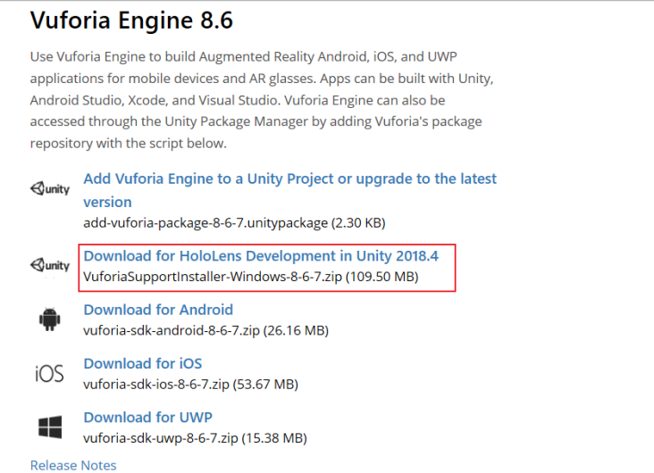  
        
    步骤为：`File->Build Settings->Player Settings->XR Settings->XR Support Installers`，然后会自动找到下载好的`VuforiaSupportInstaller`，点击`运行`即可。 

    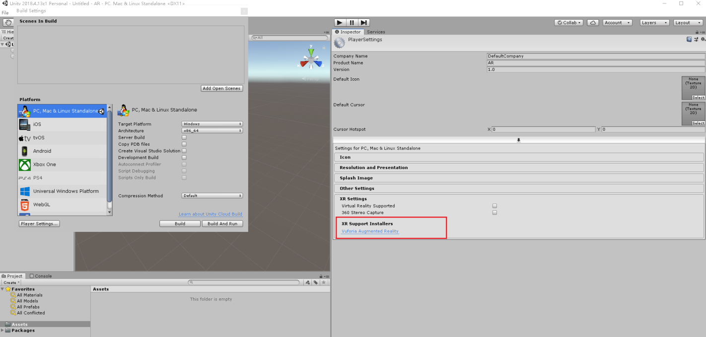  

    然后再勾选`XR Settings`中的`Vuforia Augmented Reality Supported`

    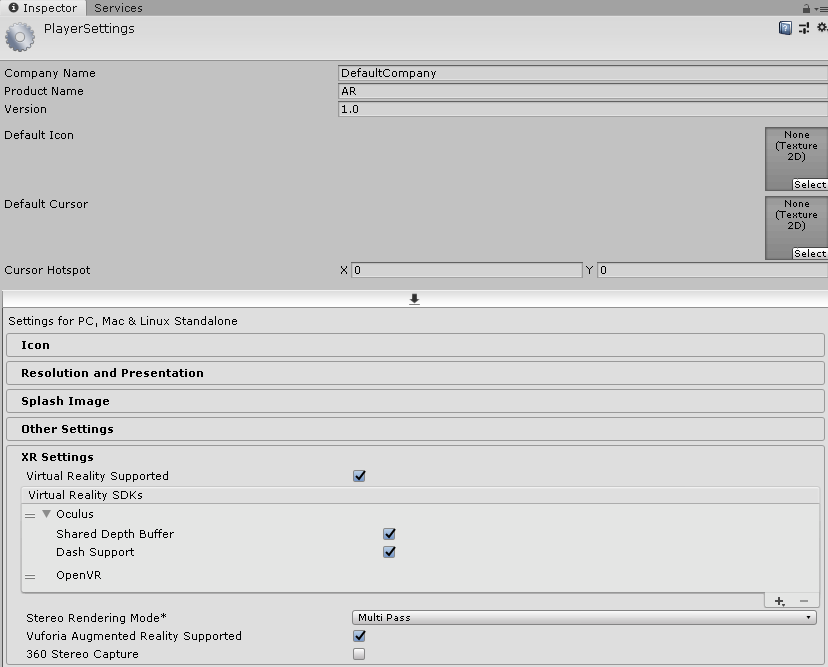   
    
6、**`下载识别的图片数据`**
点击`Targets`界面的右上角`Download Database(All)`，再出现的下载页面中选择`Unity Editor`  

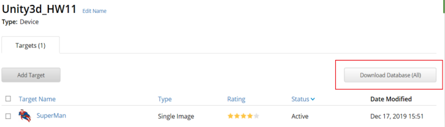  
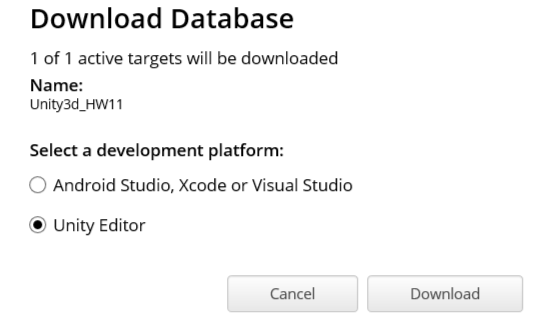  
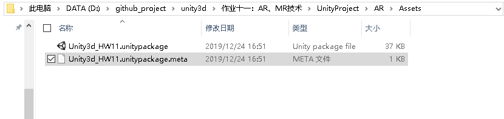  

7、**`将生成的unitypackage导入到项目中`**  

步骤为：`Assets->Import Package`  

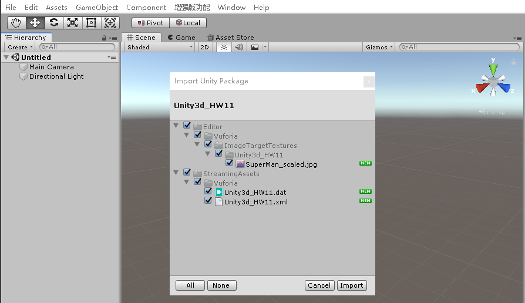  

8、删除场景中原有的摄像机，并在`Hierarchy`界面`Create->Vuforia Engine->AR Camera`  
  
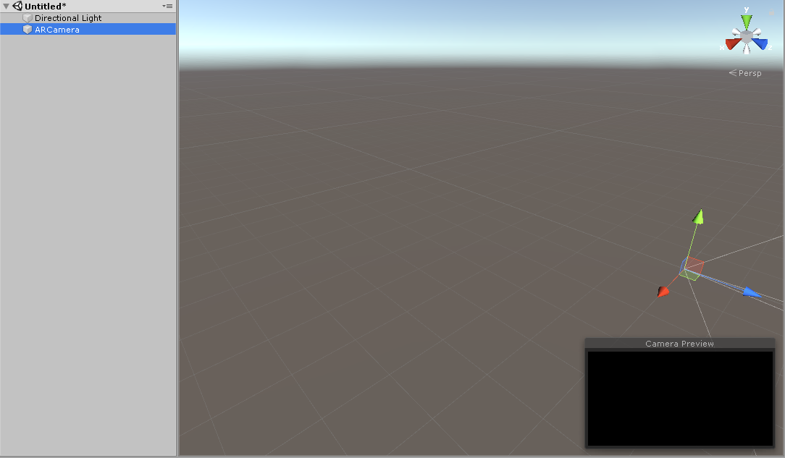  

9、从ARCamera的检视面板中打开`Vuforia配置文件`，将证书管理器中获取的`Key`写入配置文件同时激活相应`数据库`  

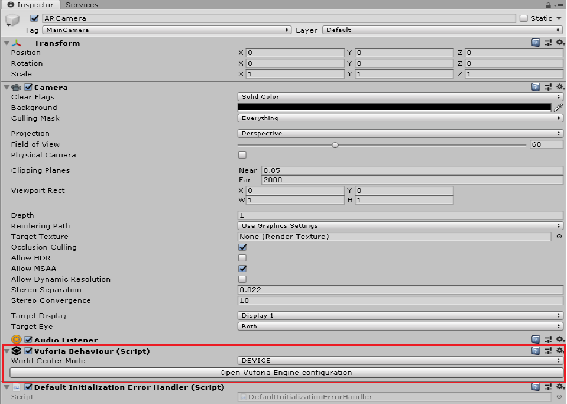  
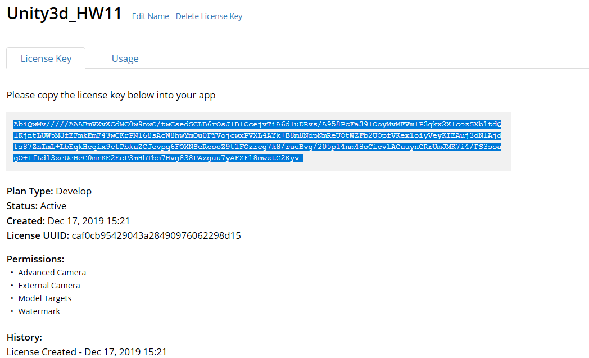  
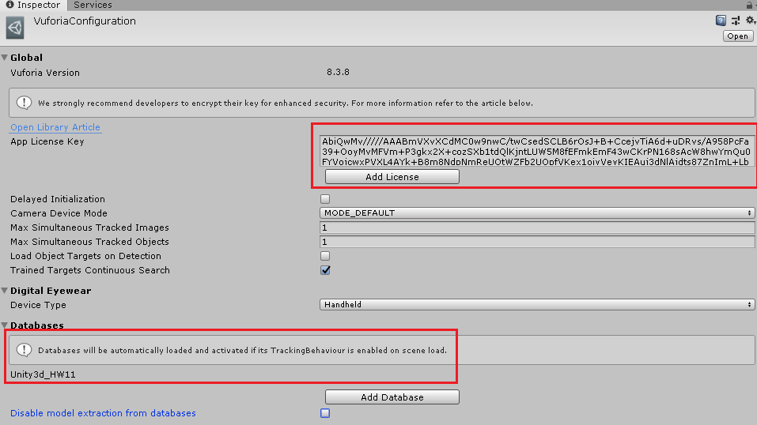  

10、然后在`Hierarchy`界面中`Greate->Vuforia Engine->Image`创建一个`ImageTarget`，表示识别一张图像，其中含有处理图像的脚本。将`ImageTarget`的`检视`面板中的`Image Target Behaviour`的`Database`设置为创建好的数据集，`Image Target`设置为需要识别的图像。接着在`ImageTarget`下放一个物体模型，作为识别图像后显示的物体  

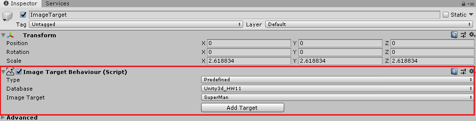  
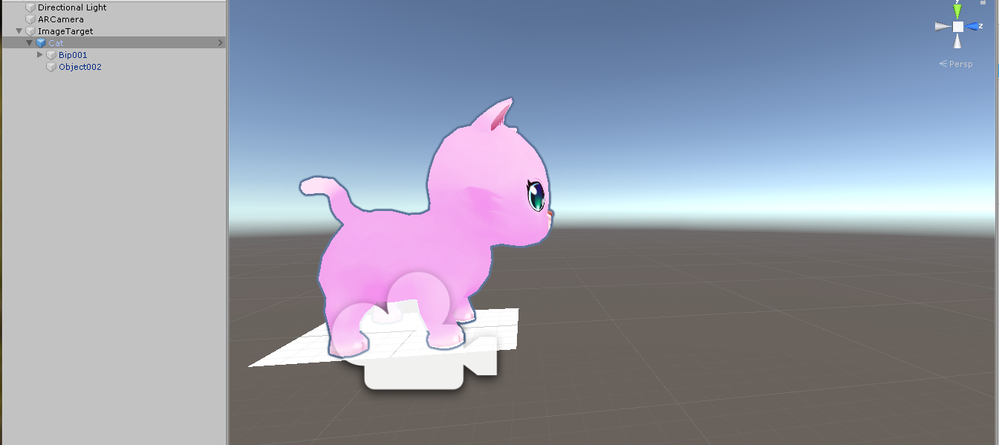  

11、点击运行，将要识别的图片对准摄像头，即可成功识别  

  

## 虚拟按键小游戏

