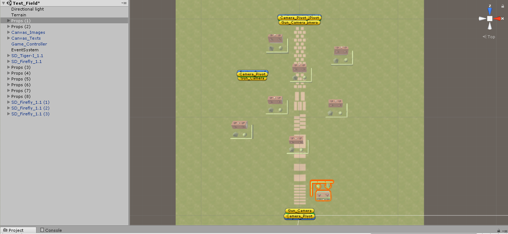
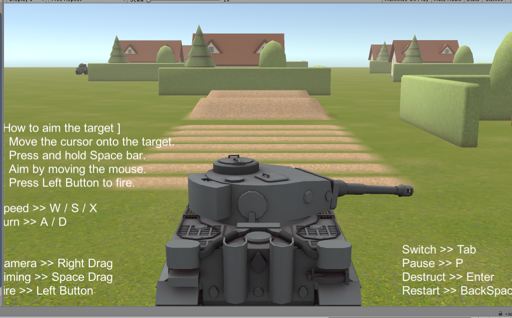

# 作业十：游戏智能
## 坦克对战游戏AI设计  
## 演示视频链接：http://www.iqiyi.com/w_19sb5xk8i9.html
### 要求
从商店下载游戏：“Kawaii” Tank 或 其他坦克模型，构建 AI 对战坦克。具体要求
- 使用`“感知-思考-行为”`模型，建模 AI 坦克
- 场景中要放置一些`障碍`阻挡对手视线
- 坦克需要放置一个`矩阵`包围`盒触发器`，以保证 AI 坦克能使用射线探测对手方位
- AI 坦克必须在有目标条件下使用`导航`，并能绕过障碍。（失去目标时策略自己思考）
- 实现`人机对战`

### 实现过程
**`1、 场景布置`**  

首先在`Asset Store`中下载`Kawaii Tanks`：

  

然后 `Import` Kawaii Tanks包：

  

使用`Kawaii_Tanks_Project->Kawaii_Tanks_Assets->Scenes`中的`Test_Field`做为游戏场景：

  

在原来的基础上添加一些房子和`Tank`：



最后导入`Unity->Editor->Standard Assets`中的如下包：
 
  

运行游戏，出现以下界面：

  

**`2、用Navigation实现智能寻路`**  

首先通过`Windows->Navigation`添加`Navigation`界面：

  

然后设置场景中各物体的`Navigation`属性：  
先选中`Terrain`，勾选其`Navigation Static`属性，表示静止物体，然后将`Navigation Area`设置为`Walkable`表示为`可移动区域`(房子等其他障碍物都默认为`Walkable`)  

  

接着选中游戏对象`SD_Firefly_1.1(1..3)`，为其`Mainbody`添加`Nav Mesh Agent`组件：`Add Component->Navigation->Nav Mesh Agent`，做为智能寻路的`AI坦克`：

  

最后进行`烘焙`生成`网格导航图`：`Navigation->Bake->Bake`：

  

**`3、脚本添加`**

首先为每个`Tank`添加`Track脚本`，以跟踪其他`Tank`：
```C#
using System.Collections;
using System.Collections.Generic;
using UnityEngine;
using UnityEngine.AI;

public class Track : MonoBehaviour
{
	public GameObject targetTank; // 设置目标坦克
	NavMeshAgent nma;  // 添加NavMeshAgent组件
	// Use this for initialization
	void Start()
	{
	}

	// Update is called once per frame
	void Update()
	{
		// 设置AI坦克的目标位置
		GetComponent<NavMeshAgent>().destination = targetTank.transform.position;
	}
}
```  

接着为了让`AI坦克`能够发射导弹，需要修改`Tank`的`Fire_Control_CS`脚本：使`AI坦克`能够每隔`2s`发射导弹：

  

最后修改`Damage_Control_CS`脚本，设置当`AI坦克`血条为0时消失：

  

**`4、运行结果`**  

给每个`AI坦克`的`Track`脚本设置`Target Tank`为`SD_Tiger-I_1.1`（游戏坦克）的`Mainbody`以跟踪坦克：

  

运行游戏，结果如[视频](http://www.iqiyi.com/w_19sb5xk8i9.html)


