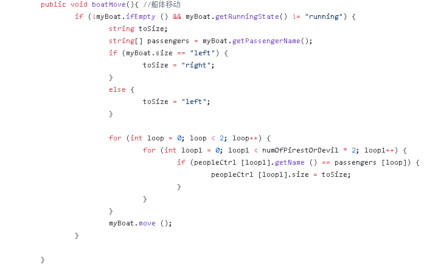
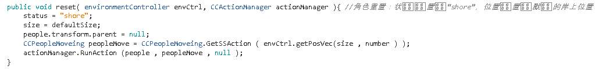

# 作业四：游戏对象与图形基础
## 1、基本操作演练【建议做】
- 下载 Fantasy Skybox FREE， 构建自己的游戏场景  
   - 由于我Unity版本限制，Fantasy Skybox FREE不能下载，所以用Skybox Series Free代替  
  
          
      
   - 首先为自己的游戏场景创建一个Skybox，参考Skybox Series Free，在Assets中新建一个Material命名为“skybox”，然后将其右边栏的Inspector中的shader改为Skybox/6 Sided，接着分别将下载资源中的贴纸拖到建立的skybox的6个方向上，形成一个完整的skybox，最后通过调整color、Exposure（亮度）、Rotation（旋转）等属性得到如下效果：  
      
          
      
   - 接下来创建地形，先在Assets Store中下载Paper Environment，里面有各种各样的Meshs用于地形的设计。  
     
          
      
   - 然后Hierarchy栏中创建一个对象Terrain，通过调整其属性栏中的Brushes以及添加新的Mesh来设计地形。  
     
          
          
   - 最后设计的结果如下：  
     
        
- 写一个简单的总结，总结游戏对象的使用  
    目前已经涉及到的GameObject如下：
   - Empty：可用于挂载脚本加载资源
   - Camera：用于调整场景显示的视角
   - Light：用于调整场景的光线
   - Audio：场景中的音效
   - 3D Object：场景中的角色
## 2、编程实践
### 演示视频链接：
**牧师与魔鬼 动作分离版（并实现裁判类：游戏达到结束条件时，由裁判类通知场景控制器）**  
- 由老师给出的UML图可知，动作分离的目的是将游戏动作的实现从场景控制器中分离出来用一个单独的动作管理器类控制，从而达到：1、简化场景控制器；2、更方便为对象添加、删除动作。
      
      
- 在牧师与魔鬼初版中，船的运动主要由场景控制器中的类boatMoveBehave实现，然后由船体控制器类boatController中的Move函数调用(其中updateBoatMove为boatMoveBehave类的实例)，最后再在firstSceneController中由boatMove函数最终实现。
      
      
      
    
- 然后牧师与魔鬼的动作由角色控制类peopleController中的函数getOnBoat和getOffBoat实现，然后由firstSceneController类中的getBoatOrGetShore函数控制。 
      
      
      
- 现在要实现动作管理器，就需要将上述的两个主要类型角色的动作从场景控制器中分离，按照老师给出的类图以及模板，首先要实现动作的基类SSAction，直接按照老师给的代码略作修改即可。  
      
  
- 然后是分别实现船和人的动作分离，船：先将原来的boatMoveBehave类注释掉，另外单独实现一个CCBoatMoving类实现boatMoveBehave的功能，即设置一定的速度然后根据条件改变船的位置（aim）。然后再修改原来的船控制器中的move函数，将用boatMoveBehave类的实例的地方改为用CCBoatMoving类的实例（代码中的boatMove，actionManager为动作管理器的实例），同样的修改原来boatMove函数以及与船相关的reset函数，因为原来的这些函数都依赖boatMoveBehave类。  
  
      
      
      
      
      
      
- 人：同样用一个单独的类CCPeopleMoveing实现其简单动作，即上船或者上岸，也就是其aim的改变。然后再修改角色控制器peopleController类中的getOnBoat以及getOffBoat函数，让其调用CCPeopleMoveing类中的函数（通过CCPeopleMoveing类的实例peopleMove）。最后再修改与人移动相关的reset函数。  
  
      
      
      
  
- 最后根据上面的修改结合老师给的代码完善动作管理器类SSActionManager如下：
  
      
      
- 实现裁判类：对于这个裁判类，我的理解是将原来在场景控制器中的status的变化控制抽离出来形成一个单独的类，即状态的变化由裁判类控制，然后裁判类再将状态信息告知场景控制器，让场景做出相应变化。因此裁判类只需要返回一个当前的游戏状态即可。  
  
      

- 然后原来场景控制器中的游戏状态设置函数Update以及getStatus函数就需要通过裁判类Judge的实例judge调用其中的getStatus函数来的得到当前的游戏状态。  
  
      
      
